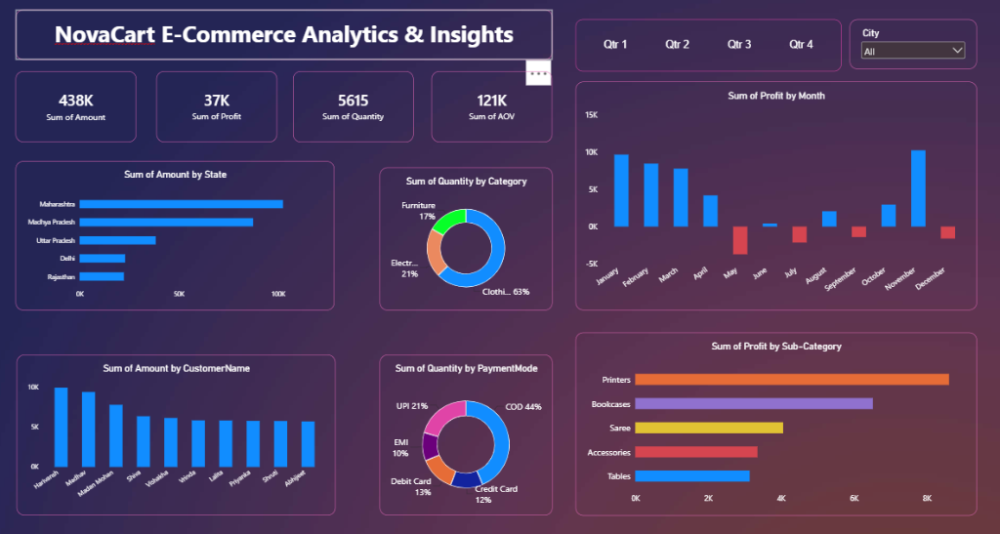

# 📊 NovaCart E-Commerce Analytics & Insights



## 📖 Overview
The **NovaCart E-Commerce Analytics & Insights** is a comprehensive and interactive Power BI project designed to analyze and visualize sales performance, profitability, and customer behavior for a retail e-commerce business. By transforming raw transaction data into actionable insights, this dashboard empowers decision-makers to track key performance indicators (KPIs), understand geographic and categorical trends, and optimize business strategies.

## ✨ Key Features
- **Sales & Profit Analysis**: Deep dive into overall sales, profitability, and volume trends over time.
- **Geographic Insights**: Visualize performance across different states and cities to identify top-performing regions.
- **Category & Sub-Category Breakdown**: Understand which product categories drive the most revenue and profit.
- **Customer Behavior**: Analyze order patterns, payment modes, and top customers.
- **Interactive Filtering**: Dynamic slicers and filters for granular data exploration by date, region, and product category.

## 🗂️ Data Sources
The dashboard is built upon two primary datasets:
1. **`Orders.csv`**: Contains order-level details, including `Order ID`, `Order Date`, `CustomerName`, `State`, and `City`.
2. **`Details.csv`**: Provides line-item transaction metrics, including `Order ID`, `Amount`, `Profit`, `Quantity`, `Category`, `Sub-Category`, and `PaymentMode`.

## 🛠️ Data Modeling & Relationships
A robust data model was established in Power BI using a **1-to-Many** relationship between `Orders.csv` and `Details.csv` connected via the `Order ID` key. This relational model ensures accurate aggregation and filtering across all visuals.

## 🚀 Technologies Used
- **Microsoft Power BI**: For data modeling, DAX calculations, and interactive visualization.
- **Power Query**: For data cleaning, transformation, and shaping.
- **DAX (Data Analysis Expressions)**: For creating calculated measures and KPIs (e.g., Total Sales, Profit Margin).

## 📥 How to Use
1. Download and install [Power BI Desktop](https://powerbi.microsoft.com/desktop/).
2. Clone or download this repository:
   ```bash
   git clone https://github.com/omm-prog/NovaCart-ECommerce-PowerBI.git
   ```
3. Open the `Retail Sales & Profitability Dashboard.pbix` file in Power BI Desktop.
4. Interact with the visuals, apply filters, and explore the insights!

---
*Created with ❤️ for data-driven decision making.*
